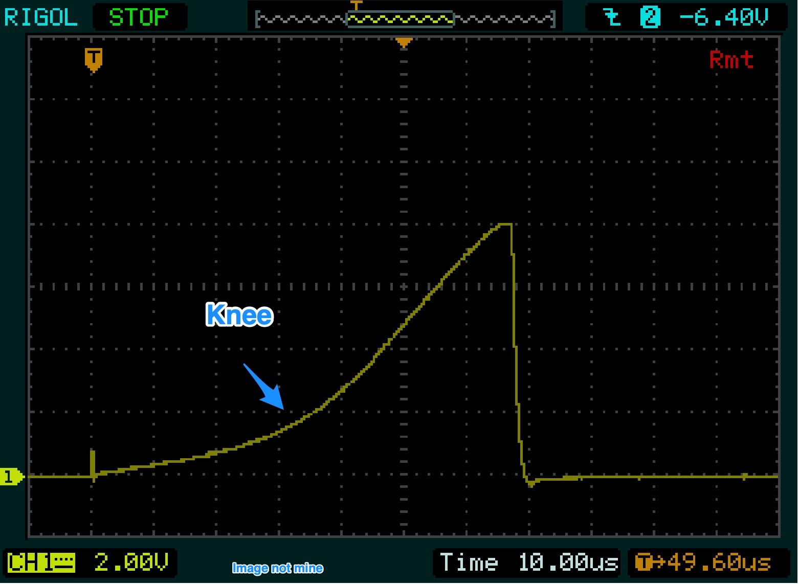
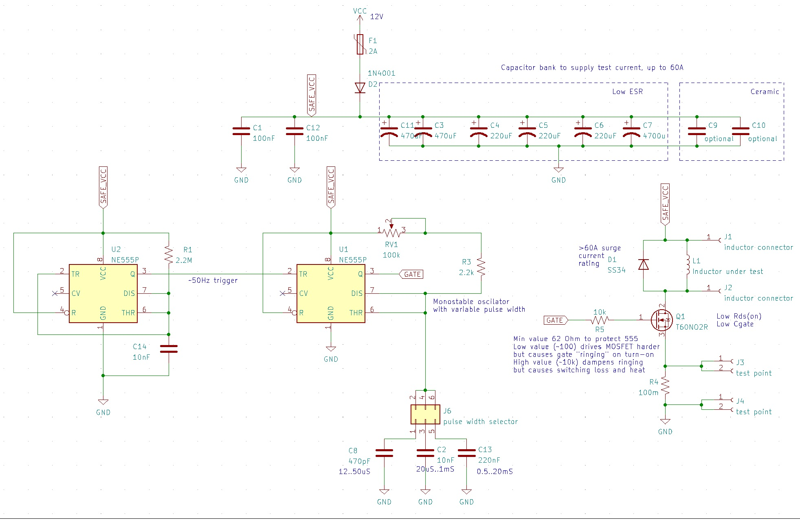

# (Power) Inductor saturation current tester

~60A max current. Power supply 5-25V.
Based on http://elm-chan.org/works/lchk/report.html

You will need an oscilloscope to take measurements.

# Theory

Once powered, the capacitor bank charges up. The circuit fires off a variable-width pulse into the MOSFET gate. MOSFET turns ON and short-circuits the inductor to the capacitor power bank. The current starts to rise linearly until the saturation point is reached. Once the inductor is saturated, it behaves like an ohmic piece of wire, and the current increases exponentially until the pulse is over, and the MOSFET is switched OFF. Saturation is a knee, not a sharp point. So you have some wiggle room in what current you designate as a "saturation current." Before the saturation point and including the "knee region," inductance will be higher than labeled. Once saturated sufficiently - inductance will drop.

Commercial manufacturers pick the point where a power inductor loses 20-30% of its labeled inductance. One can safely operate inductors at x1.3-1.5 their knee point.

You take voltage drop measurements across 0.1 Ohm resistor, multiply by 10 and get current in Amps flowing through your inductor under test. `I = V*10`

You can also compute actual inductance be taking your supply voltage and dividing by the voltage slope. 
`L = Vs * Δt / ΔI`. 

# Practical operations

See "sort-of" instructions video https://www.youtube.com/watch?v=3Y_WcuIenSM
Notice that although their PCB is labeled 1us..50us. It's impossible to get a positive pulse width of less than 10uS with NE555. One can replace it with other astable timers ICs, but you need a separate MOSFET driving circuitry. NE555 raising and falling times ~350ns, with a max current of 200mA, which is not enough to quickly switch power MOSFETs ON/OFF. The MOSFET will be in its linear region for some time. Therefore the trigger pulse is set to ~50Hz, letting MOSFET cool down between pulses. Also, notice that the current sense shunt, capacitor bank ESR and traces resistance limits max current to ~56A.
You would want to rig some sort of replacable solder-pads on the top of the PCB, so you can finger-press small SMD inductors to it and solder large ones to take measurements. There are header holes for this.

* Unplug the power
* Turn the potentiometer all the way counterclockwise. Set the duration selector jumper to the shortest range. 
* Connect oscilloscope probes
* Plug the power
* Look at the oscilloscope
* Turn the potentiometer clockwise (increasing the pulse width) until you see the saturation knee
* If you still see a linear ramp, unplug, change the duration selector jumper to the next position, turn the potentiometer all the way counterclockwise and repeat
* Take measurements

# Manufacturing

[PCB STEP model](main.step)